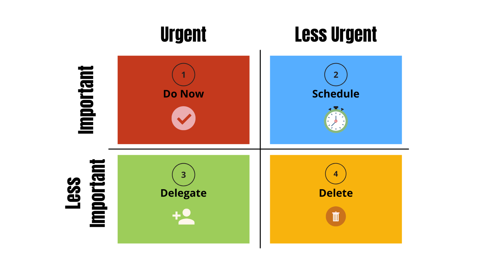

# 🏛️ Management & Team Building Document

## <mark style="color:red;">**Management & Team Building**</mark>

***

### <mark style="color:yellow;">Core skillset managers need</mark> 

Communication, people management, planning & organisation

Recruiting for technical skill only promote expert novices with low awareness and poor leadership and management skills. They won’t be able to satisfy the requirements of line managers and won’t be equipped to meet long-term needs and challenges.

Sink or swim as a manager leads to expert novices who lack critical leadership skills. Managers influence and manage all of the staff and provide direct results to clients. They need to be trained in leadership development.

### <mark style="color:yellow;">Top ten things managers feel their peers don’t do well</mark> 

\-Clearly communicate\
\-Effectively plan\
\-Deal with conflict at work\
\-Make decisions\
\-Give effective feedback\
\-Delegate\
\-Listen and being accessible to reports\
\-Setting goals\
\-Coaching reports\
\-Demonstrating emotional intelligence

### <mark style="color:yellow;">Types of management</mark> 

<mark style="color:yellow;">**Competing**</mark> - Might makes right. Do what I want. When quick decisions are needed. Important for welfare of staff or protecting against unfaithful actors.

<mark style="color:yellow;">**Accommodating**</mark> - Allowing the wider team to influence decision-making. Build up credits for later. When competition would have a negative impact.

<mark style="color:yellow;">**Avoiding**</mark> - Trivial issues. When satisfying your needs are impossible. Waiting - gathering information. When others can resolve the conflict.

<mark style="color:yellow;">**Collaborating**</mark> - When the solution is too important to all parties. Objective is the learn. Merge insights and work through hard feelings.

<mark style="color:yellow;">**Compromising**</mark> - When goals are moderately important. Not worth the effort of potential disruption. When two equal parties are equally committed to mutually exclusive goals. Temporary settlement. Expedient solution when other modes fail.

## <mark style="color:red;">Styles of management</mark> 

***

### <mark style="color:yellow;">**Directive**</mark>

Planning, define priorities, feedback, micro-managing, checking - monitoring, teaching and showing how. Telling someone what to do.

Low competence and high commitment (directing)\
\-The need recognition of enthusiasm and transferable skills\
\-They need clear goals and standards for a good job done\
\-They need hands-on training and action plans\
\-Timelines and priorities\
\-Frequent feedback

### <mark style="color:yellow;">**Coaching**</mark>

Questioning, clarifying, praising, share feedback, encouraging, exploring. End result and encourage thinking. The coachee directs the agenda, and the coach facilitates. Talk less than them. Praise, listen and facilitate.

Some competence and low commitment (coaching)\
\-They need clear goals\
\-They need to know it’s OK to make mistakes and to know why jobs are done\
\-They need the opportunity to discuss concerns\
\-They need involvement in decision-making and problem-solving\
\-Encouragement

### <mark style="color:yellow;">**Support**</mark>

Asking and listening, reassuring, appreciating, encouraging feedback, collaborating. Facilitates self-reliance.

High competence and variable commitment (supporting)

\-A mentor or coach\
\-Opportunity to express concerns\
\-Support and encouragement to develop problem-solving skills\
\-Help looking at skill objectively\
\-Praise and recognition for high competence and performance\
\-Obstacles removes and opportunities to work in a team

### <mark style="color:yellow;">**Delegation**</mark>

Empowering, affirming, knowledging, challenging, confirming. Independence and autonomy.

Standards are unique - no one has your standards. Style will be on a task-by-task basis and not uniform for each person.

High competence and high commitment (delegating)\
\-Variety and challenge\
\-A leader who is more of a leader and mentor\
\-Acknowledgement of contribution\
\-Autonomy, authority and trust

## <mark style="color:red;">Management Skills</mark>

***

### <mark style="color:yellow;">Rundle-Flanigan Model for behaviour</mark> 

Active & Constructive - Perspective taking. Creating solutions. Expressing emotions. Reaching out\
Passive & Constructive - Reflective thinking. Delay responding. Adapting\
Active & Destructive - Winning. Displaying anger. Demeaning others. Retaliating\
Passive & Destructive - Avoiding. Yielding. Hiding emotions. Self-criticising

### <mark style="color:yellow;">6 Styles of management</mark> 

<mark style="color:yellow;">Coercive</mark> - Tightly controlling. Focuses on negative feedback. One-way conversations.\
<mark style="color:yellow;">Authoritative</mark> - Vision and long-term vision. Influences employed. Firm but fair.\
<mark style="color:yellow;">Affiliative</mark> - Promote harmony and cooperation. Promoting teamwork. People first.\
<mark style="color:yellow;">Democratic</mark> - Group consensus and management. Hands-off and team participation. Trust.\
<mark style="color:yellow;">Pace-setting</mark> - Top quality work. When not up to standard, the manager does it themselves.\
<mark style="color:yellow;">Coaching</mark> - Professional growth. Help employees improve and develop. Mistakes are lessons.

### <mark style="color:yellow;">Delegation</mark> 

Delegation is not abdication - Not pawning work off onto people.

You want to be replaced and train your successor.

Delegation: Offer complete jobs to willing and able workers. Inform others of the delegation. Let go and coach. Praise a job well done.

3 Golden rules of delegation:\
\-Be hands off\
\-Keep your eyes open and monitor\
\-Praise success, correct errors

Seven levels of delegation

1. Do what I do
2. Have a look and tell me what you think
3. Give me recommendations, I’ll let you know the best way
4. Do it with my go ahead
5. Do it unless I say not to
6. Do it and let me know
7. Just do it

The why before the what brings less resistance.

Delegation is also to get the best out of people.

### <mark style="color:yellow;">Delegation Framework</mark> 

Delegating is entrusting a task to someone else that you’re accountable for.

\-Explain why the job is important. Show trust.\
\-Describe what results are needed. Leave out the how (if possible)\
\-Give them authority to do the job.\
\-Indicate when the job has to be done by.\
\-Give them feedback on their work\
\-Ask for their feedback to gain understanding.

### <mark style="color:yellow;">7 Ways to delegate work</mark> 

\-Do what I say. Little delegation\
\-Look into this and give me options. I’ll decide the action.\
\-Give me your recommendation and I’ll let you know if you can start.\
\-Decide and let me know, but wait for my goahead.\
\-Decide and let me know what you’re doing unless I say not to.\
\-Do it and let me know what you did\
\-Do it yourself

### <mark style="color:yellow;">7 Levels of delegating work to a group</mark> 

\-Manager decides and announces\
\-Manager decides and explains why\
\-Manager presents decision and invites questions\
\-Manager presents provisional decision and invites conversation\
\-Manager presentes problems and asks for suggestions, then decides\
\-Manager presents problems and the team decides\
\-Manager allows the team to identify problems and execute solution

### <mark style="color:yellow;">Engagement</mark> 

Ensure the goal alignment at every level is well-communicated. Top managers set business objectives, missile managers create specific objectives for employees that support goals. Employees should be given the tools to succeed, autonomy of some kind, and accountability to meet goals.

Vital steps of engagement:\
\-Recognise the high performers\
\-People should understand how their job contributes to the business strategy\
\-Senior leadership continually updates and communications strategy\
\-Business goals are communicated company-wide

Satisfied employees: feel safe at work and are given good training. They are valued and compensated fairly. They need to achieve against a purpose and meaning; an objective. They need to work in a trusting team that supports one another. You need to learn and grow.

### <mark style="color:yellow;">Skill / Will matrix</mark> 

Low skill / Low will - Nervous beginner\
Low skill / High will - Guide beginner\
High skill / Low will - Excite, bored\
High skill / High will - Delegate, growing

Everyone should be performance managed.

What is your purpose?

### <mark style="color:yellow;">Millennials vs management</mark> 

Managers don’t typically know what millennials want from work, how they want to be managed and they feel their managers are underperforming. Being respected and valued is the more important value, with career progression and being trusted to get on with things, and good communication. Managers fail to understand the gap between what millennials value and what they actually want.

### <mark style="color:yellow;">Time Management</mark> 

You can’t manage time - you can only spend it. Use the diamond principle - rock solid and clear objectives. Priorities will be clearer. When juggling lots of tasks - What will matter the most long term; Which impact will be the most valuable.

Starting point - diamond principle

Middle - negotiable

Endpoint - Most valuable impact

Diamond principle: “The Diamond Principle, briefly, is that the people who actually do the work in question need to be consulted before the work is changed, or a new pro­cess is implemented.”

### <mark style="color:yellow;">Self-Questions</mark> 

\-Is what I’m doing strategic?\
\-What am I giving up to do this?\
\-Am I the best person to do this?\
\-Who can I develop to do this?\
\-How can I turn this into a process?

### <mark style="color:yellow;">Mitigation</mark> 

\-Act now\
\-Schedule a time to act later\
\-Delegate the task\
\-Learn to say no

### <mark style="color:yellow;">Effective time-usage</mark> 

Being non-stop busy makes you neither important nor effective. Find time to be reflective.

Urgent, not important - Trivial ad-hoc interruptions. (Reject diplomatically) 10%\
Not urgent, not important - Irrelevant and unproductive comfort. (Resist and stop) 0%\
Urgent, important - Serious issues, troubleshooting, deadlines (Do it now) 20%\
Not urgent, important - Modelling, designing, planning (Plan to do) 70%

Say no to stuff that doesn’t suit your purpose.

Work to a schedule as well as a to do list. Take breaks.

### <mark style="color:yellow;">Task Management</mark> 

\-Do it\
\-Delay it\
\-Delegate it\
\-Drop it

Separate the imperatives from the desirables.

### <mark style="color:yellow;">Procrastination</mark> 

\-Create checklists and todo lists\
\-Break up the work into smaller chunks\
\-Minimise distractions

## <mark style="color:red;">Problem-Solving</mark> 

***

### <mark style="color:yellow;">Example of problem-solving</mark> 

Candle problem - functional fixedness. Assuming conditions limiting possible solutions

### <mark style="color:yellow;">Frugal Innovation</mark> 

\-Keep it simple\
\-Leverage existing technologies\
\-Expand horizontally, not up

### <mark style="color:yellow;">Balance</mark> 

\-Acknowledge reality\
\-Accept the truth - take responsibility\
\-Set a realistic timeframe\
\-Have a balanced approach to balance

### <mark style="color:yellow;">Planning</mark> 

Complexity is the enemy of execution

### <mark style="color:yellow;">The six thinking hats</mark> 

White - explorer - Focus on information that’s available. This is information gathering.

Red - justified emotional - Focus on legitimacy of feelings and intuition. Gut feelings without explanation.

Black - Logical negative - Identifying issues logically with facts and evidence, regulations and strategy.

Yellow - Logical positive - Focus on benefits, feasibility and added value.

Green - Creative - Modifications and improvements, and fault correction.

Blue - Process - Managing the thinking. Focus on agenda, next steps, inclusion, requests, summary and conclusion.

### <mark style="color:yellow;">Review current process</mark> 

\-Research industry best practice\
\-Gain as much feedback as possible\
\-Continuous improvement

### <mark style="color:yellow;">Continuous improvement</mark> 

\-Plan\
\-Do\
\-Review\
\-Revise

Proper planning & preparation prevents poor performance\
Planning is short-term sacrifice for long-term benefit\
Bulletproofing\
What are you doing?\
What are you struggling with?\
What do you want to do next?

## <mark style="color:red;">Managing change</mark> 

***

### <mark style="color:yellow;">Essentials of making change</mark> 

\-Reason and purpose\
\-Commitment & communication\
\-Current culture and how this affects it\
\-Reactions\
\-Time of change

### <mark style="color:yellow;">Change planning</mark> 

\-Create urgency for the change\
\-Form a powerful coalition. Persuade others that change is necessary\
\-Create a vision for the change\
\-Communicate that vision\
\-Remove obstacles\
\-Create short-term wins that are visible\
\-Build upon the change and improve\
\-Anchor the change in the culture

## <mark style="color:red;">Meetings</mark> 

***

### <mark style="color:yellow;">Meetings</mark> 

M - Meet or not to meet. If the meeting has no value don’t have it\
A - Agenda - what is it for?\
G - Guidelines. How should it run?\
I - Involvement. Make sure everyone knows the role they’re playing\
C - Clarity of communication.

Keep the meeting flowing\
Follow up afterwards immediately

### <mark style="color:yellow;">Contributing to meetings</mark> 

Use ‘I’ statements - use personal opinion in place of stating facts of personal truth.

Agree with others when you do

Be constructive and personal when disagreeing. Speak from personal experience and opinion.

Asynchronous collaboration

Collaborate before the meeting on a sheet or something shared. Come with prepared and old thoughts and thinking.

Always go in thinking there’s a third way

## <mark style="color:red;">Appraisals</mark> 

***

### <mark style="color:yellow;">Beginning</mark> 

Explain structure of appraisal

Gather other people’s opinions. They need time to prepare.

### <mark style="color:yellow;">Self-Assessment</mark> 

Encourage them to be open about strengths and development areas.

Allow them to suggest solutions and answers. They’ll buy in more if they’ve been involved in finding the solution.

### <mark style="color:yellow;">Closing</mark> 

Set objectives.

Get the op to write up their 1-2-1 and send it to me (yearly only)

Send a write-up to managers.

General

\-Planning and preparation (ask for a self appraisal) - location (discrete and neutral)

\-Main discussion - two-way dialogue. Achievements, feedback on company, criticism

\-Targets. SMART (specific, measurable, achievable, relevant, time-based)

\-Positive appraisals can help prevent demotivated workers. Work should be met with reward.

\-Confirm understanding when giving tasks with open-ended questions

## <mark style="color:red;">Team Building</mark> 

***

Team members need to feel motivated, inspired and motivated by their manager to work at their best.

### <mark style="color:yellow;">Team-Forming</mark> 

Team Leader

Stage 1 Forming Telling\
Stage 2 Storming Selling\
Stage 3 Norming Participating\
Stage 4 Performing Delegating

<mark style="color:yellow;">**Forming**</mark> - Direct the team clearly and establish objectives. Define purpose. Encourage confidence. The team has anxiety about their new roles and connection with the group. Energy is internal to one's own inadequacies.

<mark style="color:yellow;">**Storming**</mark> - Some question the team and resist. Establish process and structure. Build relationships. Keep spirits up when it’s tough. Be positive and firm to challenge. Explain this. Resolve issues. Finding one's position in the team.

<mark style="color:yellow;">**Norming**</mark> - Start to develop relationships and roles are established. The team has established itself. Step back and let the team take responsibility. Team building events and give rewards. Focussed on task accomplishment.

<mark style="color:yellow;">**Performing**</mark> - Getting the work done. Delegate and develop individuals. Focus on other goals.

\-Create common goals and values\
\-Let new members know where they fit in\
\-Create a social calendar

### <mark style="color:yellow;">Commitment</mark> 

1 - The cause. What do we want to achieve. Mission and vision.\
2 - The what. What is our output?\
3 - The how. How will this be done? Ownership of results\
4 - Principles. Behaviour and conduct.

### <mark style="color:yellow;">Feedback for ideas - saying no</mark> 

Explain why. Ask for an alternative

### <mark style="color:yellow;">Dealing with Change</mark> 

1 - Deal with worries and anxieties - effective proactive throughout communication\
2 - Be positive about change without being punished\
3 - Present as an opportunity to develop

1 - Involve the team in decision-making before the change\
2 - Encourage regular feedback\
3 - Measure and celebrate quick wins - incremental goals - be open about progress

### <mark style="color:yellow;">Chaos theory & Planning for change</mark> 

Planning is merely our best guess. If any factors have been missed or mis-read, then predictions become unreliable. Strategies for change if planned to rigidly are likely overtaken by unpredictable events. A plan should set a direction for a specific goal and make a plan keeping in mind the unpredictability of the future. You must allow for flexibility and responsiveness for unforeseen or unknown changes.

### <mark style="color:yellow;">Effective team management</mark> 

\-The team know what is expected of them\
\-They have the skills to deliver those expectations\
\-Are supported into developing\
\-Are given feedback on their performance\
\-Are able to contribute to the team

### <mark style="color:yellow;">Poor Performers</mark> 

A - Awareness. They need to be aware of their performance\
U - Understanding. They need to understand the impact of their performance\
C - Capable. Are they able to do the job (skills / knowledge)\
C - Capacity. Are they equipped to do the job (tools / resources)\
C - Commitment. Are they committed to the company? Motivation

### <mark style="color:yellow;">Inclusion</mark> 

Women tend to underestimate their abilities.\
Bring everyone to the table.

### <mark style="color:yellow;">Creativity and growth</mark> 

Solitude promotes creativity and ideas with freedom and autonomy.

Bring joy to developing the team. Let it happen by itself - do without doing. Create the process and the conditions > autonomy. Promote trust by requiring collaboration.

### <mark style="color:yellow;">Team self-evaluation</mark> 

\-What’s going well?\
\-How do we need to improve?\
\-Working climate\
\-Resources\
\-Communication\
\-Support\
\-Conflict

### <mark style="color:yellow;">Running a brainstorming session</mark> 

\-State the problem and purpose of the session\
\-Come up with answers and display with no judgements\
\-Encourage creativity\
\-Shortlist ideas

### <mark style="color:yellow;">6 Thinking Hats</mark> 

\-Factual thinking. Specifics and analyse information\
\-Emotional thinking. Intuition and emotion\
\-Critical thinking. Caution and highlighting weak points\
\-Positive thinking. Optimism and looking at advantages\
\-Creative thinking. Create solutions to problems and possibilities\
\-Thinking process. Take control of the thinking process of the group

### <mark style="color:yellow;">Exercises</mark> 

Go around the table with an issue and present an opinion / solution / pass\
Sticky note idea writing and combine and group

### <mark style="color:yellow;">Stories to use</mark> 

When Brandi Chastain scored a devastating goal for the other team

last summer, team captain Carla Over beck walked right up to her and told her, "Brandi, we have 85 minutes to get that goal back. We need you focused and fully into the game. Let's play.

### <mark style="color:yellow;">What makes a great team?</mark> 

A successful team boils down to two things: mutual respect among team members and a common vision

about where the team is going.

Number two, all team members have to be positive thinkers. A team just can't function with an excuse-

driven, "no-can-do" member on board

Number six, each member must trust the motives of the other members.

Two, the members need to be driven by the team's results, not by individual results.

### <mark style="color:yellow;">Interpersonal Development Review</mark> 

For those who want to learn about it, small group sessions to discuss is a great idea.

Discuss how it was used, what was useful, how you did, is there anything new you found?

### <mark style="color:yellow;">Imposing change</mark> 

Radical change imposed causes resistance and creates a worried workforce. This is followed by cynicism and disillusionment.

Too low anxiety erases possibilities for change and creativity, while too much creates panic and defensive behaviour. Change requires a leader to create the right amount of urgency to bring change.

### <mark style="color:yellow;">Self-organisation</mark> 

This only happens when people can network and interact with complete freedom. They need empowerment first. Self-organisation is intricate teamworking where webs of communication exist. Each person pursues their own objectives they have set for themselves. Change is embraced if it has been happening already and not imposed from the top down. The environment needs to have stable management and actual leadership. The environment needs to exist between too much stability and too much chaos.

### <mark style="color:yellow;">Types of team communication</mark> 

Legitimate formal - structured communication channels and processes like emails and meetings.\
Shadow informal - general talking and gossip in social groups

### <mark style="color:yellow;">High performing teams</mark> 

High performing teams are highly focused on their goals and return superior results. They outperform expectations. The output is greater than the sum of their parts. Collaboration and innovation. Strong accountability and trust.

### <mark style="color:yellow;">Qualities of a HPT</mark> 

\-Interdependence. Everyone relies on everyone else\
\-Manager has good people skills. Committed to the team\
\-Each person is willing to contribute and share\
\-Relaxed climate for communication. Open and honest\
\-Established mutual trust\
\-Prepared to take risks\
\-Clear on goals\
\-Roles are defined\
\-They know their strengths and development areas\
\-They know how to read results\
\-Everyone is encouraged to create new ideas\
\-They know they can influence the whole teams results

### <mark style="color:yellow;">Building a HPT</mark> 

\-Decide with the team how we’re going to build the culture\
\-Provide clear expectations and priorities\
\-Give ownership with shared goals\
\-Get the team involved in problem-solving\
\-Make sure the team has an input into agendas\
\-Detail new projects\
\-Keep open lines of communication (keep members involved in planning)\
\-Encourage team code of conduct\
\-Provide individual coaching

### <mark style="color:yellow;">Company goals</mark> 

To unify all development information on learning, performance, and career planning for the sake of talent overview. Workforce visibility and quality builds flexible labour models. In competitive industries, it’s crucial for companies to understand who their key talent is, who is at risk of leaving, and what strategies will work. Companies should develop and monitor their employees.

Companies work better and become more efficient when they work on implementing integrated talent management. This increases employee agility in deployment. More data on employees can lead employers to make better decisions.

People are often the most expensive thing for an organisation and also the least optimised. This can be down to inadequate talent management which fails to delivery workforce visibility.

Nurturing High performers

Give them space to try. They fear not trying over fearing failure.

They enjoy the chase of learning and innovation as much as the win.

Get out of their way.

Nurture and mentor high performers.
