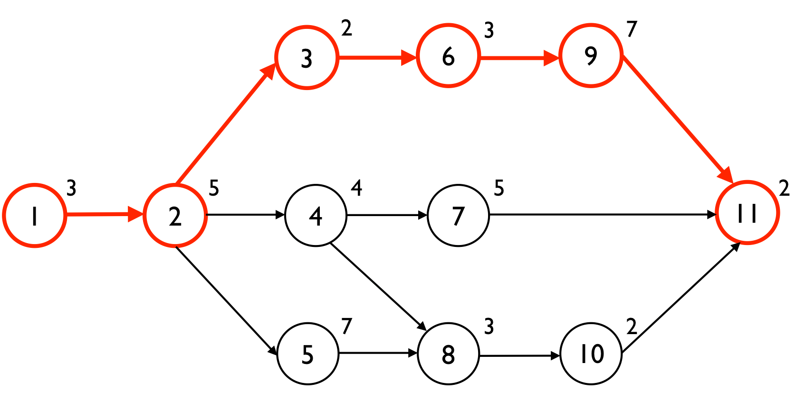

# 👷‍♂️ Project Management & Writing Reports Document

## <mark style="color:red;">Project management</mark> 

***

### <mark style="color:yellow;">Project Management</mark> 

\-Set objectives\
\-Gather resources\
\-Organise\
\-Ownership\
\-Communication\
\-Monitor\
\-Keep the end in mind

Project managers are the focal point for the project. Who integrate and facilitate activities and assume responsibility for its success. They introduce discipline and structure and support the overall program.

Measuring performance is an ongoing project management task. Regular reporting enables quick response to deviation. Relevant information is communicated to the right people regularly. Organisations that aren’t structured well make project management difficult.

Adopting the wrong methodology or not having a project framework will likely result in miscommunication within the team, wasting time on tasks with no purpose, and project management burnout. The company should want the project to succeed, there should be effective reporting, methodologies are documented, staff are continuously trained, project information is communicated continuously, and projects are monitored for performance.

The more complex and the longer a project will take, the ‘heavier’ your methodology should be. You should ask: Why are we doing this and who will benefit? Why do it now? How will we measure success?

To the organisation, a good project manager delivers high quality projects on time. To a team member, a good project manager maintains a pleasant and rewarding work environment. There needs to be a balance of leadership (communication, vision, interpersonal skills), and management (knowledge, methodology, tools, analysis and problem-solving skills).

The most important competency is communication with others in groups or individually. They articulate the vision and sell the benefits to others. They must be strong listeners who show empathy. They must listen to concerns from the team which ensures respect and spots early warning signs.

Self-motivation is also critical and the ability to motivate staff. They give recognition and praise to those who achieve to encourage motivation. They are both mentoring and supervising. They can supervise without dictating. They put controls in place and monitor them. They reason and persuade instead of using carrots on sticks.

The project manager must follow their own rules and embrace them. They follow and enforce the standard processes. The role is both supervisory and supportive. They provide tools, templates, and training. They might develop software or documents or plans that are uniform across the organisation. This is the supportive side. The supervisory role is more hands-on and imposes greater discipline on how projects are carried out. They enforce standard methodologies, processes, templates, and tools.

The project manager encouraged innovation but can also shut down failing projects. They can look outside the organisation for other companies’ ideas and practices. They communicate new ways of thinking and introduce new tools and processes. They are crucial to knowledge management and becoming the organisation’s memory by keeping records. Knowledge management ensures everyone knows what has happened so it can be passed on.

### <mark style="color:yellow;">Planning</mark> 

The planning phase identifies the size of the project and enables it to be broken down into smaller chunks. Planning involves scope, dependencies, estimates, costs, contingencies, and estimated timings.

Risk management is an important part of planning. This includes exit points where you can terminate the project while still having some benefits or atleast minimising loss.

Be realistic with time estimates and build in necessary time.

Write a list of constraints that will impact the project and include in the planning.

### <mark style="color:yellow;">Implementation</mark> 

Review the plan for transitioning from old to new and the plans for training and implementation of the new thing.

Consider reservations or negative comments and ensure uncertainties are resolved.

### <mark style="color:yellow;">Post implementation</mark> 

Write up an overview of the project performance.

### <mark style="color:yellow;">Why projects fail</mark> 

Projects fail because of unrealistic plans and deadlines set without reference to logistics or work content. They fail from poor relationships and lack of planning and commitment. They fail from lack of clear, measurable, and testable objectives, and lack of executive sponsorship and commitment. They fail from weak management and no or poor communication strategies.

### <mark style="color:yellow;">Cost benefit analysis and risk</mark> 

The cost and or benefits should identify tangible and intangible benefits. Benefits might be money saved, hours saved, turn-around time reduction etc. There should be at least 2 viable solutions. Each alternative should be analysed separately and justified.

How much will this cost to implement and maintain? How much will it save? What is the best approach for the highest quality and lowest cost? Is it worth doing?

Risk analysis should identify constraints on the project's budget, schedule, scope and quality. Risks should be planned for and minimised. Risk analysis should ask: what are the chances of success? What will be done to maximise success chances? Is there enough contingency in the budget and schedule?

Add up all of the benefits, and subtract the costs. Benefits are often reviewed over time and this time effect can be built into the analysis for payback period. Cost benefit can also put a financial value on intangible costs and benefits. A cost benefit analysis finds, quantifies, and adds all the positive factors - the benefits, then does the same for the negatives and costs and subtracts from the benefits. The difference indicates the planned action.

Assumptions are a potential source of risk. Assumptions should be recorded in the project definition. Assumptions should be put through the what if/then analysis process. What will be the impact if the assumption is false? Prioritise assumptions that may have greater impact. Constraints and assumptions change throughout the project and can be less or more significant. These must be tracked and evaluated routinely. Risk is essentially loss, injury, or disadvantage.

Risk = probability of event x cost of event.

Risk management means identifying concerns, and identifying risks. Evaluating risks as to likelihood and consequences, and assessing options for accommodating risk. Prioritising the risk management efforts, and developing risk management plans. Implementing those plans, and tracking risk management efforts over time.

A concern is an issue involving some doubt. Spend time identifying concerns and then assess the existence of risk. Ask other people who might have different perspectives. Project risks usually come from issues of competence, experience, organisation culture, and skill of the management team.

### <mark style="color:yellow;">Threats</mark> 

Identify what threats might face you:

Human - from individuals\
Operation - from suppliers or operations, loss of access to assets\
Procedural - failures of accountability or internal systems and controls\
Project - Risk of cost overruns, jobs taking too long, insufficient product or service\
Financial - Not enough money or business failure\
Technical - Advances in technology or technical failure

### <mark style="color:yellow;">Risk management options</mark> 

<mark style="color:yellow;">Avoidance</mark> - use alternate approach\
<mark style="color:yellow;">Control</mark> - controlling risks and risk reduction\
<mark style="color:yellow;">Acceptance</mark> - accept and proceed\
<mark style="color:yellow;">Risk transfer</mark> - attempt to pass risk to someone else

The risk management plan RMP encompasses an approach to risk management from moderate to high risk.

## <mark style="color:red;">Management areas</mark> 

***

<mark style="color:yellow;">Scope</mark> - Define and accountable for integrity. Track changes and gather data for impact

<mark style="color:yellow;">Quality</mark> - Responsible for quality and accountable for overall health. Reporting and reviewing

Time - Work out schedule and develop / maintain. Analyse impacts of tasks, changes, and earned value analysis

<mark style="color:yellow;">Cost</mark> - Budget and funding. Track expenditures. Analyse spending and report deviation.

<mark style="color:yellow;">Risk</mark> - Canvas team for risks. Develop mitigation strategies. Facilitate team sessions to identify risks and track

<mark style="color:yellow;">Procedure</mark> - Procuring resources and keeping communication open with procurement

<mark style="color:yellow;">Communicate</mark> - Communicate with organisation. Negotiate conflict. Delegate tasks and facilitate planning

<mark style="color:yellow;">Integrate</mark> - Ensuring the plan and processes are followed. General project communication

<mark style="color:yellow;">Human</mark> - Resolve conflicts, boost morale, gain team buy-in. Ensure all resources are there and educate team

### <mark style="color:yellow;">Project Control Officer</mark> 

They educate the team on proper processes, standards, and methodologies. They facilitate and oversee project planning and control sessions. They deal with planning, developing, work breakdown structure WBS, develop diagrams, estimating hours etc. They develop the project schedule and develop critical path analysis. They manage the schedule and keep it on time. They track and analyse costs. They forecast and make recommendations.

### <mark style="color:yellow;">Scope Management</mark> 

After you plan the work you have to work the plan. The scope is the logical boundaries of a project which need to be defined and managed. If you can’t accommodate change, the final solution might be less valuable or unusable. You want the flexibility to make changes mid-project.

Scope creep is when you accept a large number of small changes that add up and take over giving you too much extra work. Change is the rule and how change is reacted to and anticipated can mean success or failure.

### <mark style="color:yellow;">Stakeholder Management</mark> 

The more successful you are, the more people you will affect. This includes people with influence over your projects. An important discipline is stakeholder management to win support and ensure projects succeed.

Stakeholder analysis is to identify the key people to be won over and build rapport with. Powerful stakeholders can influence others early on. Their input can help improve the project, too. Gaining their support wins more resources. Communicating frequently ensures they understand what you’re doing and understand the benefits. This means they support you actively. Anticipate reactions and plan actions that will win support.

Work our key player’s power, influence and interest to know how to focus on. Develop a good understanding of key stakeholders to predict their reaction and work out how to win their support.

You can use a power interest matrix to see what to do with people.

High power, high interest - Manage closely\
High power, low interest - Keep satisfied\
Low power, high interest - Keep informed\
Low power, low interest - monitor with minimum effort

What financial or emotional interest do they have in your work? What motivates them? What information do they want from you? How do they want to receive information? What is their current opinion? Who influences their opinion? If they’re not positive, what will win them over? If you can’t win them over, how do you manage their opposition?

### <mark style="color:yellow;">FMEA</mark> 

A methodology to analyse potential problems early in development. Failure modes and effects analysis. The development team should formulate an extensive list of potential failure modes. FMEA also captures historical information for use in future projects.

They can be used to identify design characteristics that contribute to failure and design them out of the system. They develop methods for testing and ensuring failures have been eliminated.

Benefits are a prioritisation of process deficiencies, capture organisation knowledge, emphasise problem prevention, document risk and actions taken, and to provide focus for improved testing and development.

\-Describe the process and its function\
\-Create a block diagram of the process.\
\-Complete the FMEA form worksheet header.\
\-Identify failure modes (the ways in which something can fail)\
\-Describe the effect and add severity ranking\
\-Identify causes and add probability rating\
\-Identify current controls and likelihood of detection\
\-Review risk priority number RPN. Severity x probability x detection\
\-Determine actions and assign responsibilities\
\-Indicate actions taken

Example:

item/function - potential failure - potential effects - severity - potential causes - probability rating - current design controls - detection - overall rating - recommended actions - responsibility and target date - action taken - new severity - new detection - new probability - new overall rating

### <mark style="color:yellow;">PRINCE2</mark> 

Provides a controlled and organised smart middle and end. Gives regular reviews against the plan and offers flexible decisions. AUtomatic management control of deviations and utilised the management and stakeholders at the right time. Good communication channels between everyone.

The 8 processes:

\-Directing the project\
\-Planning\
\-Starting up\
\-Initialising\
\-Controlling a stage\
\-Managing product delivery\
\-Managing business boundaries\
\-Closing the project

Starting, initialising, and closing are phases. Controlling a stage, managing delivery, and managing boundaries are in the implementation. Directing applies for the length of the project, and planning applies to all stages except closing.

<mark style="color:yellow;">**Starting**</mark>

Setting up the project correctly. Is the project worthwhile and viable? Identify senior decision makers required to oversee and endorse the project. Prepare a project brief, define the approach, and plan the initiation stage.

<mark style="color:yellow;">**Directing**</mark>

Elements are authorising initiation, authorising the project, authorising a stage, giving direction, and confirming closure.

<mark style="color:yellow;">**Planning**</mark>

This runs through the project. The elements are designing the plan, defining and analysing the products, identifying activities and dependencies, estimating, scheduling, analysing risks, and completing a plan. The deliverables need to be checked. Any significant deliverable should be quality checked. Plans must be well-engineered, but also correct.

<mark style="color:yellow;">**Initiation**</mark>

Elements are planning quality, the project, refining business case and risks, setting project controls, setting up project files, and assembling a project initiation document.

<mark style="color:yellow;">**Controlling a stage**</mark>

This involves authorising work packages, assessing progress, capturing project issues, examining them and reviewing stage status. Reporting highlights, taking corrective action, escalating issues, and receiving completed work packages.

<mark style="color:yellow;">**Delivery**</mark>

Everything in prince2 is a delivery or product. Elements are accepting, executing, and delivering the work package.

<mark style="color:yellow;">**Managing boundaries**</mark>

Each stage must be completed and approved by the project board before going ahead. ELements are planning a stage, updating the plan, updating a project business case, and updating the risk log. Reporting stage end, and producing exception plan.

<mark style="color:yellow;">**Closing**</mark>

Project must be closed in a controlled and orderly way. ELements are decommissioning, identifying follow-up actions, and evaluating the project.

<mark style="color:yellow;">**Other info**</mark>

The business case is the purpose of a business case is to justify the project. It drives the process and ensures it aligns with company values. It must be valid for the life of the project.

It uses product-based planning, not activity-based planning which can mean descriptions, diagrams, and breakdowns.

Products must be reviewed for quality. It’s highly standardised and produces common approaches and documents.

It’s document-centric in order to provide good control. It can become a negative having so many documents and can result in too much organisation and meetings becoming unproductive. On smaller projects it can be too heavy-duty.

If your planning and estimating is accurate, you can speed up the schedule by aligning parallel tasks and assigning more resources. For time estimation, remember that transition between activities takes time. Beware of external dependencies and others possibly not sharing your urgency. People optimistically tend to estimate 90% of the time it will take.

## <mark style="color:red;">Work Breakdown Structure</mark> 

***

Useful in the early stages for defining scope.

It works off of levels as the depth increases and items have a numerical number assigned such as 1.2.1.3

WBS can be deliverable or process-driven and built around objects or actions.

As the project grows and the complexity increases, the WBS can evolve into a time-phased activity list. The WBS should be compatible with how the work will be done, give visibility to important or risky work, allow mapping of requirements, plans and testing, and foster clear ownership by managers and task leaders. Ity should provide clear data for performance measurement and make sense.

### <mark style="color:yellow;">Gantt Charts</mark> 

Easy method to document schedules in a horizontal bar chart. It shows start, end, duration, and completion of tasks and shows the connection between events. Each activity should be assigned to someone for responsibility ownership so it’s clear who’s responsible for what. The schedule won’t reflect the effort required.

Dependent activities are sequential, and others that are not dependent are not and can be done at any time. These are parallel tasks. For each task, show the earliest start and estimated length and whether it’s sequential or parallel. Schedule parallel tasks to not interfere with sequential or critical path tasks. Allow for some slack in the schedule for overruns and holdups. Microsoft Project is a good organiser.

.png>)

### <mark style="color:yellow;">Delivering sooner</mark> 

Add people to the schedule. It will slow things as they learn what to do but it will then increase productivity.

Improve productivity and work longer hours. Don’t lose the team to attrition. Look for opportunities for tasks to overlap. Consider innovation to technology of processes or look for alternatives.

### <mark style="color:yellow;">Resourcing</mark> 

You have to define the resources required in isolation from the people involved. Fill a project with roles and make the people fit what’s needed. People might be able to be taken part-time. There might also be another way of doing things.

If the organisation limits the people and resources, they need to accept the limitations to the project. You need to identify gaps in resources and take actions to plug them regardless of your given resources. Don’t just accept the resources you have and don’t ignore what the project needs.

### <mark style="color:yellow;">Critical Path</mark> 

CPA helps you plan all the tasks that must be completed on the project. It’s the vital list of tasks for the project to be considered a success. Critical path can be analysed with circle and arrow diagrams. Numbers above the circles show the earliest completion time.

It shows all activities that will take place. PERT is similar and used to identify time.\
Shortest time + 4 x likely time + longest time / 6.

### <mark style="color:yellow;">Monitoring and Control</mark> 

Project monitoring is to ensure the team is making satisfactory progress. You track and review accomplishments and results, and revise the plan to reflect accomplishments, and to revise the plan for remaining work.

Deliverables for monitoring are written reports, updated action items, risks, problems, and updated to the plan and schedule. A monitoring framework is to break down activities into low focus, medium focus, and high focus. For example, how would you low focus monitor a task, medium focus monitor, and high focus monitor? Make a 3-stage focus chart.

Measure achievements of milestones against the plan and report variance. Checklists can be used as a prompt for undertaking activity. They are accumulated wisdom. What goes wrong in one project will likely go wrong in another, so record and identify issues.

### <mark style="color:yellow;">Stakeholder communication matrix</mark> 

You can note down the stakeholders by stakeholder, roles and responsibilities, goals, and expectations. This means the person, their responsibilities, what they hope to achieve, and what the outcome should be.

## <mark style="color:red;">Writing reports</mark> 

***

What’s a report? It provides a permanent and comprehensive account of an investigation, and includes information required for decision making. The quality of the report indicates the quality of the work.

They are to inform, recommend, motivate, persuade, reinforce or to instruct.

It needs to ensure a common understanding, stimulates others to take action, and directs the flow of information to open discussion.

Pain word pictures, use images, involve the reader, have a clear and simple

layout and make it easy to understand and read. Proof read everything before you send it out.

KISS - Keep it short and simple.

### <mark style="color:yellow;">Barriers to communication</mark> 

Sender complications - Internal framework and filters. Preconceived opinions of the receiver.

Message complications - Unclear writing.\
Channel complications - Mistakes from the message medium.\
Receiver complications - The receiver doesn’t understand but won’t tell you.\
Feedback complications - no way to deliver feedback.

### <mark style="color:yellow;">Effective communication</mark> 

Focus on the intended audience. Be brief, clear, understandable and succinct.

Be precise and say what you mean, and use appropriate technical language. Set it out in a logical way.

Be adequately descriptive and use the right language.

Each sentence should deal with a single point.

Be business-like, not business-minded. Don’t use cold emotionless words. Relax and sound natural.

Keep it simple. If in doubt, leave it out. Learn and practice, and use single sentences for single ideas.

Make sure you know the word's meaning - don’t use jargon.

Use active language - what do you think?

Avoid ambiguity. Make sure it reads smoothly with logical transitions between points. The layout should be attractive to the eye. Each paragraph should be complete.

### <mark style="color:yellow;">Punctuation</mark> 

Uses - practical for signposting, creative to assist tone, and correct use in proper grammar.

Check punctuation and read the sentence out loud. Check pauses and emphasis.

Brackets. Don’t overuse them. Perhaps another sentence would be better.

### <mark style="color:yellow;">General tips</mark> 

One word is better than two. Use simple words and avoid unexplainable words. Be concise and specific. Avoid condescending phrases and negative language. Stress the positive. Avoid showing a lack of commitment. Keep sentences less than 20 words or you risk misunderstanding. Keep long words to a 10% maximum. FOG index.

SPACE - simplicity, positiveness, active voice, conciseness, effectiveness. Taking risk is not having control or safety. Entrepreneurs seek to control what looks uncontrollable to the outside world and have the resilience to persevere.

### <mark style="color:yellow;">Planning</mark> 

What do I need to achieve? What is the subject?\
Who are the readers and do I need to write this report?\
What is the best format to achieve the result?\
What type of writing? Descriptive, explosion, argument, narrative?

### <mark style="color:yellow;">Goals when communicating</mark> 

_When informing_.

_When you’re requesting_ - should contain details about the steps the receiver should take and contain all information they need to complete the request.

_When trying to persuade_ - must provide ample rationale.

_When building a relationship_.

### <mark style="color:yellow;">What reports need</mark> 

Planning - to plan what you’re going to write

Title / heading - the main title

Paragraphs - to break up information

Report headings - section headings

Summary - to provide a wrapup at the end

### <mark style="color:yellow;">Report structures</mark> 

_Normal_

Introduction - what you’re about to say

Body - what you’re saying

Summary - to sumamrise what you said

_Technical_

Mimic scientific paper: Abstract / summary, introduction, method, results, discussion, appendices.

### <mark style="color:yellow;">Reviewing</mark> 

Does this contribute to my or the company’s objectives? Is this useful to someone else? Am I passing the buck?

### <mark style="color:yellow;">Clarity</mark> 

No naked decimals, always add a 0. Single digit numbers are types, while double digit numbers are written as numbers. Recommendations should follow logically from the conclusions and indicate what should be done next.

Does the recommendation solve the problem? Do the body of facts support the recommendation? Is it open to interpretation? Are they possible and realistic? Are they acceptable to the organisation and do they include new options?
